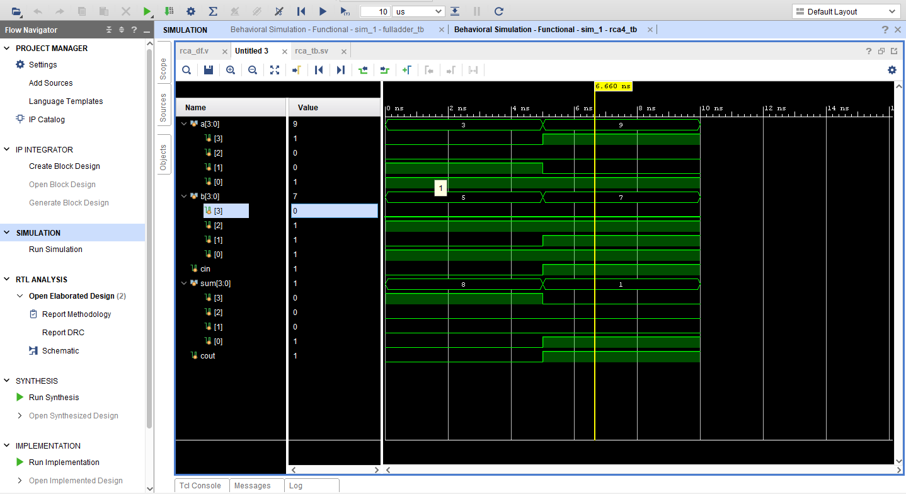

# 4-bit Ripple Carry Adder using Verilog

## Overview

A Ripple Carry Adder (RCA) is a combinational circuit used to add multi-bit binary numbers. It is constructed by cascading full adders, where the carry output of each stage is passed to the next stage.

---

## Functionality

* Adds two 4-bit binary numbers
* Includes carry input (Cin)
* Produces 4-bit sum and carry output (Cout)

---

## Implementation

### Dataflow Modeling

Uses Verilog arithmetic operator to perform addition.

### Behavioral Modeling

Uses `always @(*)` block to describe behavior.

---

## Testbench

The design is verified using a SystemVerilog testbench (`rca4_tb.sv`) with different input combinations.

---

## Waveform Output



---

## Folder Structure

```plaintext
rca4/
├── rca4_df.v
├── rca4_beh.v
├── rca4_tb.sv
├── waveform.png
└── README.md
```

---

## Tools Used

* Verilog HDL
* SystemVerilog
* Vivado / ModelSim
* GTKWave

---

## Conclusion

The 4-bit Ripple Carry Adder was successfully implemented and verified. It correctly performs binary addition with carry propagation across all bits.

---

