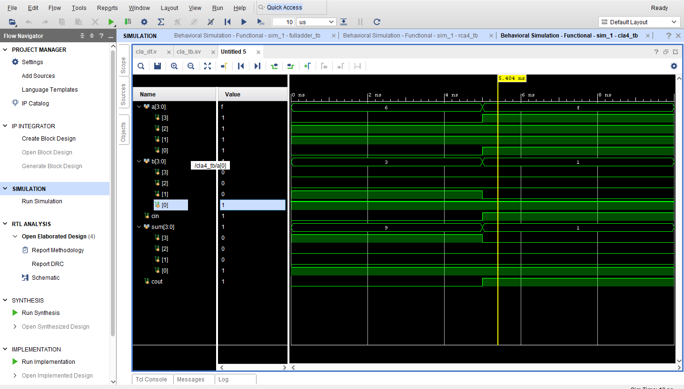

# Carry Lookahead Adder (CLA) using Verilog

## Overview

The Carry Lookahead Adder (CLA) is a fast adder circuit designed to overcome the delay caused by ripple carry propagation. It computes carry signals in advance using generate and propagate concepts.

---

## Key Concepts

* Generate (G) = A AND B
* Propagate (P) = A XOR B

Carries are calculated using:

* C1 = G0 + (P0 · Cin)
* C2 = G1 + (P1 · C1)
* C3 = G2 + (P2 · C2)
* Cout = G3 + (P3 · C3)

---

## Functionality

* Adds two 4-bit numbers
* Faster than Ripple Carry Adder
* Produces Sum and Carry output

---

## Implementation

### Dataflow Modeling

Uses generate and propagate logic for carry computation.

### Behavioral Modeling

Uses arithmetic operation for abstraction.

---

## Testbench

Verified using SystemVerilog testbench (`cla4_tb.sv`) with different input combinations.

---

## Waveform Output



---

## Folder Structure

```plaintext
cla4/
├── cla4_df.v
├── cla4_beh.v
├── cla4_tb.sv
├── waveform.png
└── README.md
```

---

## Tools Used

* Verilog HDL
* SystemVerilog
* Vivado / ModelSim
* GTKWave

---

## Conclusion

The Carry Lookahead Adder was successfully implemented and verified. It improves speed by reducing carry propagation delay compared to ripple carry adders.

---

