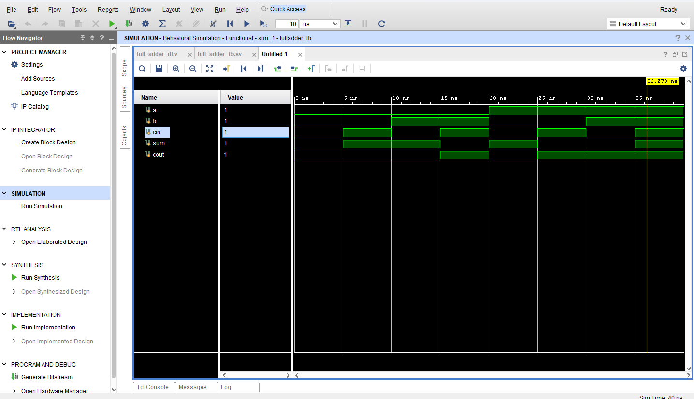

# Full Adder using Verilog

## Overview

A Full Adder is a combinational circuit that performs the addition of three binary inputs: two significant bits and an incoming carry. It produces two outputs:

* Sum (S)
* Carry-out (Cout)

---

## Truth Table

| A | B | Cin | Sum | Cout |
| - | - | --- | --- | ---- |
| 0 | 0 | 0   | 0   | 0    |
| 0 | 0 | 1   | 1   | 0    |
| 0 | 1 | 0   | 1   | 0    |
| 0 | 1 | 1   | 0   | 1    |
| 1 | 0 | 0   | 1   | 0    |
| 1 | 0 | 1   | 0   | 1    |
| 1 | 1 | 0   | 0   | 1    |
| 1 | 1 | 1   | 1   | 1    |

---

## Logic Equations

Sum = A XOR B XOR Cin
Cout = (A AND B) OR (B AND Cin) OR (A AND Cin)

---

## Implementation

### Dataflow Modeling

Uses continuous assignments to directly implement logic equations.

### Behavioral Modeling

Uses `always @(*)` block to describe behavior.

---

## Testbench

The design is verified using a SystemVerilog testbench (`fulladder_tb.sv`) by applying all input combinations.

---

## Waveform Output




---

## Folder Structure

```plaintext
full_adder/
├── full_adder_df.v
├── full_adder_beh.v
├── fulladder_tb.sv
├── waveform.png
└── README.md
```

---

## Tools Used

* Verilog HDL
* SystemVerilog
* Vivado / ModelSim
* GTKWave

---

## Conclusion

The Full Adder was successfully implemented and verified. Simulation results confirm correct functionality for all input combinations.

---

